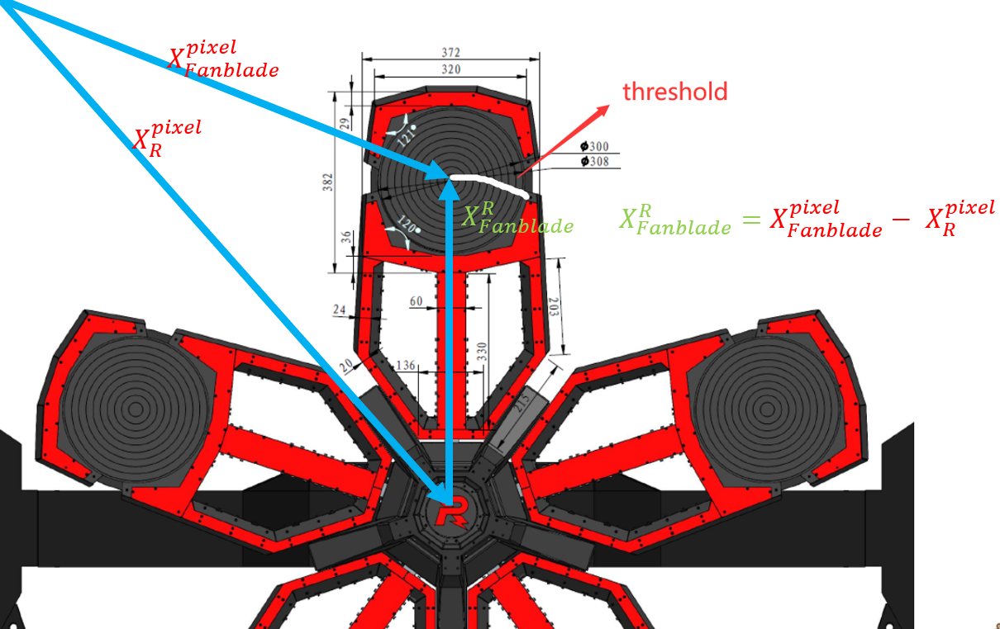

# 能量机关预测的评价标准

预测是为了使得弹丸在经过一定的飞行时间之后，能够打在扇叶装甲板上那么评价标准就可以描述为


$$
u_{\mathrm{predict}} = u_{\mathrm{t}}+\Phi(\Delta t)
$$


其中  $\Phi(\Delta t)$   为预测量，在时间经过 $\Delta t$  之后,弹丸打在装甲板的扇叶上,应满足


$$
|u_{\mathrm{t+\Delta t}}-u_{\mathrm{predict}}| < \mathrm{threshold}
$$


其中， $\mathrm{threashold}$  为**扇叶装甲板的大小**计算出的度量指标

$$
\begin{align}
&\color{red}{下面的文字建立在这样一个逻辑下:}\\
&\color{red}{1. 根据经验建立假设}\\
&\color{red}{2. 根据需求建立标准(排除弹道离散的预测误差不能超过一个装甲板)}\\
&\color{red}{3. 推导过程、实验。实验结果符合标准\to假设成立，推导结果也可用}\\
\end{align}
$$

# 思路

> 前提假设1：
>
> 能量机关扇叶到中心R在像素坐标下的距离能保持恒定（在可接受范围内波动）

那么我们可以对这个问题先进行建模：我们以**中心R**为坐标原点，建立平面直角坐标系：


$$
X_{Fanblade}^{R} = X_{Fanblade}^{pixel}-X^{pixel}_{R}
$$


$X_{Fanblade}^{R}、X_{R}^{pixel}、X^{pixel}_{Fanblade}$分别指的是：扇叶在R坐标系下的坐标，中心R在像素坐标下的值、扇叶像素坐标下的值


根据**前提假设，半径不变**，为了简化计算我们转化到极坐标系：


$$
\begin{cases}
x, \  y = X_{Fanblade}^{R} [0], \ X_{Fanblade}^{R}[1]\\
\theta =\arctan(y/x)\\
R = |X_{Fanblade}^{R}|
\end{cases}
$$


这样问题就被转化为**单变量的预测问题**，或**关于弧度的时间序列预测问题**，或**弧度-时间的拟合问题**

标准为：


$$
\begin{align}
&|\theta_{\mathrm{t+\Delta t}}-\theta_{\mathrm{predict}}|  < \mathrm{threshold}\\
\end{align}
$$

$\theta_{\mathrm{t+\Delta t}}$是现在 $\Delta t$ 时间后扇叶的弧度值，即真实值
$\theta_{\mathrm{predict}}$ 是现在预测 $\Delta t$ 时间后扇叶的弧度值

由图估算装甲板弧长  $L = 300$  ，等比例换算扇叶半径为 $\mathrm{R}=636.42$  

$$
\mathrm{threshold}=0.5 \cdot L / R=0.2356
$$


大概为**13.504度**





## 大能量机关(一阶差分法+拟合)：

> 结论
> 优点：
>
> 1. 任意预测时间差都能获得很不错的精度
>
>    (这个精度指的是，会在±7°之内，一般会在[-5°, +5°])
>
> 2. 可根据弹丸飞行时间调节
>
> 缺点:
>
> 1. 需要一定的时间收集数据，在3s多左右，

### 公式计算推导

大能量机关的弧度-时间函数：


$$
\begin{align}
& \theta(t) = A\cdot \cos(B\cdot t +C)+D\cdot t+E
\end{align}
$$


进行间隔为 $\Delta t$ 的差分：


$$
\begin{align}
&\mathrm{Diff}(t, \Delta t) = \theta(t)-\theta(t-\Delta t) = A\cdot\{\cos(B\cdot t +C) - \cos[B\cdot (t -\Delta t) +C)]\}+ D\cdot \Delta t\\
\end{align}
$$


利用和差化积公式可得：


$$
\mathrm{Diff}(t, \Delta t) = A\cdot \sin(B\cdot t-\frac{\Delta t}{2}+C)\cdot\sin\frac{\Delta t}{2}+D\cdot \Delta t
$$


其中 $\Delta t$ 为超参恒定值，令 $A'=A\cdot \sin \frac{\Delta t}{2}$ ， $C'=C-\frac{\Delta t}{2}$ ， $D' = D\cdot\Delta t$ 可以简写为


$$
\Delta \theta(t)=\mathrm{Diff}(t) = A'\sin(B\cdot t + C')+D'
$$


我们把 $\Delta t$ 认为是子弹飞行时间，那么 $\Delta \theta(t)$ 我们要打的弧度提前量，对大符的预测就可以转化为，对 $\mathrm{Diff}(t)$ 这个函数的拟合。

对大能量机关进行采样，视频是50FPS，我们对未来0.2s进行预测，那么轮次差就是：50 * 0.2 = 10

进行10轮次的一阶差分【在这转为了角度制】

```python
with open(r"data/6_big_red_dark.txt", 'r') as f:
    y = np.array(f.readlines(), dtype=np.float64) * 180 / np.pi
    diff = y[10:len(y)] - y[0:len(y)  - 10]
```

用[0, 176]之内的差分数据进行拟合，得到的函数是每个位置的预测值。


图上是分别是：原始数据，平滑后的数据，和拟合的结果

图下是：拟合结果和原始数据的差，**差值波动范围大概在[-5°, 5°]，远小于13.504**

差值是，预测结果和真实位置的预测误差

我们还可以从另一个角度验证起预测精度


第一个绿点是0.2s之前，预测的结果，其与0.2s后的现在扇叶所在位置重合，证明其预测精度

第二个绿点是当下对未来0.2s进行预测

### 大能量机关拟合方法

#### 1. 数据平滑

原始差分数据环境和相机的影响，波动较大的


所以需要先对其进行数据平滑

在这里用的是滑动平均的方式进行滤波，SG滤波和指数滑动平均也可

（

效果：SG滤波 > 滑动平均 > 指数滑动平均

速度：前缀和优化，滑动平均O(1) = 指数滑动平均O(1) < SG滤波O(n)

)


#### 2. 拟合位置的选择

在收集数据过程中，我们需要确定，在什么时候进行拟合才能使现在对未来的预测达到最好的效果，根据三角函数的通式，我们需要得到的是：振幅，频率，初相位以及一个偏移常数。

那么拟合的开始位置，应该尽量保留这些信息，以让拟合得到最好的结果

所以应该在**第二个极值出现之后，进行拟合**。

我们跨固定间隔，求离散数据的增长趋势，**如果增长趋势出现两次变化，则认为出现了两个极值**

​	

上图是：原始数据和平滑数据

下图是：导数是否大于0，大于0就是1，小于0就是0

这就完成了拟合位置的选取


#### 3. 拟合初值

好的初始值设置可以帮助优化算法尽快收敛。

**振幅：选取【平滑后数据】的（最大值+最小值）/ 2**

**频率：利用【傅里叶变化时域转频域求】**

**初相位：初始为0**

**偏移常数：所有平滑的离散数据的均值**


#### 4.代码使用提醒

1. 进行【拟合位置的选择】前，应选择好数据平滑算法和调好其参数，如果出现短时间内多现个峰值，会触发报错

   ```python
   if self.isFlip():
       self.__FlipCount += 1
       if self.__FlipCount == 2:
           if self.__count < self.__lim:
               self.__count += 1  # 20个轮次以检验是不是由于滤波不够导致突发的单调性变化
           else:
               return True, self.__idx
           if self.__FlipCount > 2:
               raise ValueError(
                   "不可能在20个轮次内单调性突然变化，你需要修改滤波算法及其参数，或queue_size参数[除非你帧率很低]")
               return False, -1
   ```

   

2. 这个方法的前置需要时间 = 拟合位置出现时间+预测时间 $\Delta t$，大概在3s多

   所以会**【在开启打符后，大概3s才能开始预测打符，这是这个方法的一个缺点】**

3. 超参：

   在predict_example_main.py中

   设置红蓝颜色决定顺时针逆时针，大符小符两种预测模式、设置相机频率，预测未来的时间差

   ```python
   """
   超参数
   color = red | blue
   moveMode = mode.big | mode.small
   freq : 帧率
   time_interval : 预测间隔
   """
   color = 'blue'
   moveMode = mode.small
   freq = 50
   deltaT = 0.2
   ```


## 小能量机关(一阶差分法+平均)


小能量机关的弧度-时间函数：


$$
\theta(t) = a\cdot t +b
$$


进行间隔为 $\Delta t$ 的差分：


$$
\begin{align}
&\Delta\theta(t, \Delta t) = \mathrm{Diff}(t, \Delta t) = \theta(t)-\theta(t-\Delta t) = a\cdot\Delta t
\end{align}
$$


$a\cdot\Delta t$ 这是一个常数，求平均就是对常数的最小二乘，所以我们只需对差分结果求平均即可

同时我们可以发现：


$$
\Delta\theta(t, n\cdot\Delta t)=\Delta\theta(t, \Delta t)\cdot n=a\cdot \Delta t\cdot n
$$


在大能量机关的预测我们可知：


<div align = "center">前置需要时间 = 拟合位置出现时间+预测时间△t</div>


设，一个轮次的间隔时间为： $\Delta t_1$ ，n个轮次的间隔时间为 $\Delta t_n$ 

我们需要预测的往往不是一个轮次之后的时间，如帧率为50的相机，我们需要预测0.2s之后，则需要预测从现在往后第10个轮次

假设我们需要预测 $\Delta t_n$ 之后的值，即现在往后的n个轮次之后，可得：


$$
\begin{align}
&\begin{cases}
\Delta t_n = n \cdot \Delta t_1\\
\Delta\theta(t, \Delta t_n) = \mathrm{Diff}(t, \Delta t_n) = \theta(t)-\theta(t-\Delta t_n) = a\cdot\Delta t_n
\end{cases}\\
&\Longrightarrow \Delta\theta(t, \Delta t_n)=a\cdot \Delta t_1\cdot n=\Delta\theta(t, \Delta t_1)\cdot n\\
&\color{red}\Delta\theta(t, \Delta t_n) =\Delta\theta(t, \Delta t_1)\cdot n
\end{align}
$$


那么小能量机关的前置时间为：


$$
前\ 置\ 需\ 要\ 时\ 间 = 拟\ 合\ 位\ 置\ 出\ 现\ 时\ 间+预\ 测\ 时\ 间△t_1
$$


<center class="half">
    
    
</center>


图为以0.2s为预测量和0.6s为预测量的，预测误差，预测误差在[-9°, +9°]以内

且橘线和蓝线完全重合，故 $\Delta\theta(t, \Delta t_n) =\Delta\theta(t, \Delta t_1)\cdot n$ 是完全成立的，

**所以只需进行一个轮次的差分，预测时间换算为预测轮次n， $\pmb{n\cdot t_1}$ 即可**


