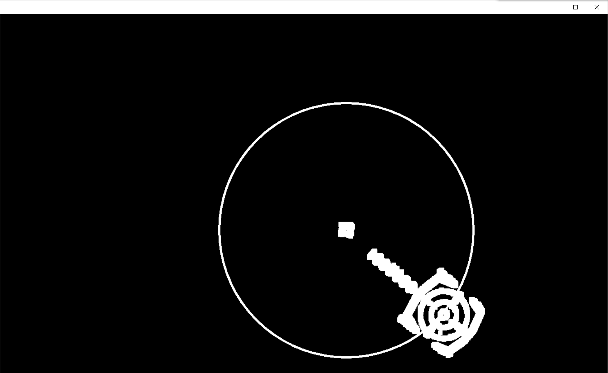
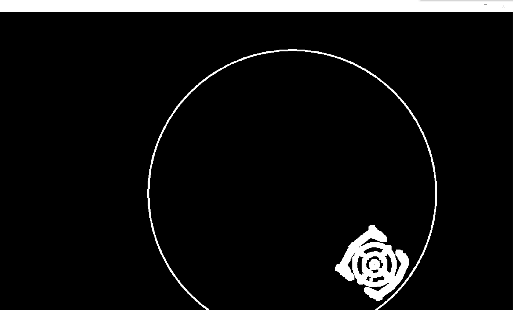
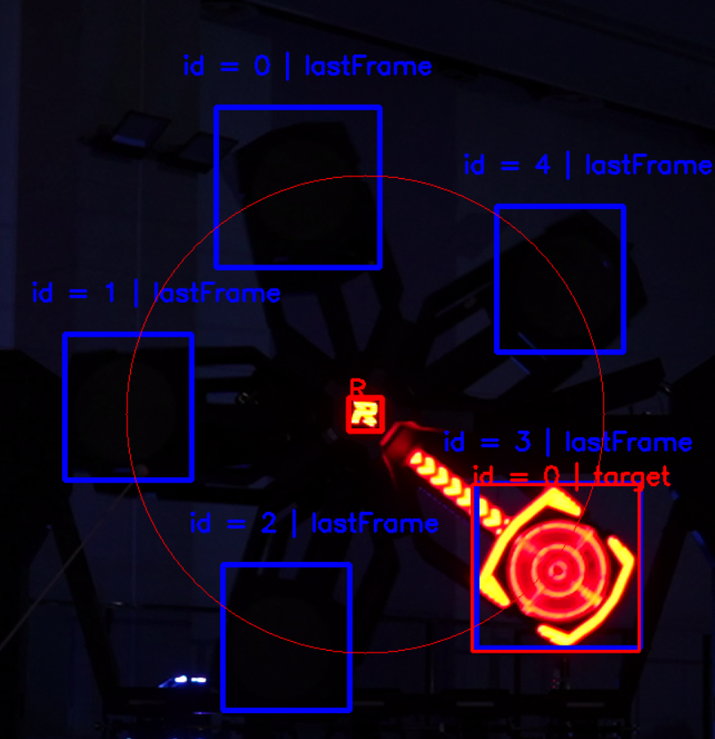

# RM_Buff_Tracker

此项目仅开源分享的思路，为了实现方便故而使用Python进行实现。

此项目纯传统，无SVM等任何统计学或深度学习的分类器，跟踪器等。

> 作者：桂林理工大学-群星战队 方玺林
> 
> QQ：2438254242

# 新增预测功能（2023/8/1）

[具体思路在predict.md内](predict.md)

运行是通过predict_example_main.py

预测相关的视频路径为：

```python
LIST = [
    r"./examples/example_for_prediction/6_dark_blue_big/parameter.yaml",
    r"./examples/example_for_prediction/7_dark_red_big/parameter.yaml",
    r"./examples/example_for_prediction/8_dark_blue_small/parameter.yaml",
    r"./examples/example_for_prediction/9_dark_red_small/parameter.yaml",
    r"./examples/example_for_prediction/10_dark_red_small_near/parameter.yaml"
]
```


# 项目依赖

1. Opencv-Python
2. Numpy
3. matplotlib
4. Scipy


## 识别分类扇叶主要思路

### 0.前提

需要知道第一帧扇叶击打框的BBOX信息和中心R的BBOX信息

>可获得的信息：
>
>1. BBOX的基本信息（长宽面积等）
>
>2. 跟踪两个BBOX的中心欧拉距离可以得到能量机关半径radius
>3. 让已得到的扇叶击打框的BBOX绕R旋转72 * i度，得到其余未亮起扇叶的位置


### 1. 获取当前帧中心的R的BBOX

先对图像二值化+膨胀（这一步的要点在于，膨胀到让流水灯和击打框链接，但不能让中心R和流水灯相连）

+寻找外接矩形，对所有外接矩形进行筛选（长宽面积和上一帧的中心R的长宽面积比）得到备选框后，用上一帧的R_BOX和所有的备选框进行CIOU（其他变体亦可，可根据效果修改），并选取最大的那个最为当前帧的R_BOX



**这一步至关重要，此思路所有的骚操作都建立在中心R 不跟丢的情况下**


### 2.获取当前帧的扇叶

>已得到了：
>
>1. 二值化后的图像
>
>2. 中心R_BOX

在能量机关外围绘制一个空心圆，在内围绘制一个实心圆




在这为了方便观看，外界圆为（255， 255， 255），但实际代码中两个都是（0， 0， 0）

外围圆的目的是为了隔绝扇叶击打框和外部可能光源产生的链接，影响外接矩形的计算

内围圆的目的是为了提出调流水灯


进一步，我们寻找最小外接矩形和外接矩形，可以得到一些系列的备选框，将备选框的位置利用其和中心R的约束关系更正到当前中心R的位置，用更正后的**上一帧框和当前帧的备选框进行IOU 操作**，即可判断哪些备选框是扇叶




<span style="color:red">你要改色的文字</span>

<span style="color:orange">你要改色的文字</span>

<span style="color:gray">你要改色的文字</span>


### 3. 扇叶分类

>这个扇叶分类的思路前提是步骤2没有匹配出错，即现在所有的框都是正确的，已经亮起的扇叶击打框。

扇叶只有三个状态：

1. <span style="color:gray">未亮起</span>
2. <span style="color:red">已亮起 | 待击打目标</span>
3. <span style="color:orange">已亮起 | 已击打</span>

扇叶亮起有以下原则：

1. 当只有一个扇叶亮起时，此扇叶一定是<span style="color:red">已亮起 | 待击打目标</span>，其他一定是<span style="color:gray">未亮起</span>
2. 当有新的扇叶亮起时（当前帧亮起扇叶个数>上一帧），新扇叶一定是<span style="color:red">已亮起 | 待击打目标</span>, 其他**已亮起**的肯定是<span style="color:orange">已亮起 | 已击打</span>，其他为<span style="color:gray">未亮起</span>

```python
if len(realFanBladeList) == 1:  # 如果只有一个扇叶亮起，则这一定是待击打目标，其他必然为未亮起
    realFanBladeList[0].bbox.id = 0
    self.states[0] = "target"
    for i_ in range(1, 5):
        self.states[i_] = "unlighted"
elif len(realFanBladeList) > self.fanNum:
    # 如果现在的亮起个数大于上一帧亮起个数，则之前为未亮起的现在一定是待击打目标
    # 上一帧是待击打目标的现在一定是已击打目标，其他不变
    id_x = realFanBladeList[i].bbox.id
    if self.states[id_x] == "target":
        self.states[id_x] = "shot"
    elif self.states[id_x] == "unlighted":
        self.states[id_x] = "target"
```


# parameter.yaml

```yaml
{
    "HSV": { # HSV的上下限
        "lowerLimit": [
            0,
            84,
            254
        ],
        "upperLimit": [
            60,
            255,
            255
        ]
    },
    "kernel": 7, # 膨胀kernel
    "outsideRate": 1.4, # 外围圆比例
    "insideRate": 0.73, # 内围圆比例
    "MayBeTarget": { # 长宽高缩放比例，用于判断筛选中心R备选框
        "width": 0.1,
        "height": 0.1,
        "area": 0.1
    },
}
```

# 识别方案的使用提醒
1. 12mm镜头会更好调参，8mm比较难调
2. 相机帧率不宜太低，太低可能导致中心R和流水灯黏连，识别会作废
3. 因为是纯传统，识别帧率和分辨率成正相关关系
4. 识别算法方案有使用前提，这个前提建议找个好点的目标检测算法进行提供，如果最开始前提的中心R和扇叶是错误的，则这个方案无法自纠

# 用法

下载下面的测试视频后，将对应视频放入对用的example之中，一开始是两个**cv2.selectROI**选取中心R后回车，再选取待击打扇叶再回车即可

>测试视频来自官方，example的测试视频链接是：
>
>链接：https://pan.baidu.com/s/1YdAHzPlLhCSI6rkbgHV1gA?pwd=6666
>提取码：6666 
>
>
>
>【识别】B站视频演示：
>
>https://www.bilibili.com/video/BV1Ug4y1P7bS/?spm_id_from=333.1007.top_right_bar_window_history.content.click&vd_source=1f5d064eea850d16e47b622112a8445b
>
>【预测】B站视频演示：
>
>[【开源】大小能量机关预测！！超准！！_哔哩哔哩_bilibili](https://www.bilibili.com/video/BV1zm4y1x7dC/?p=1&spm_id_from=pageDriver)
>
>最后感谢桂电老哥提供的旧能量机关相机内录视频
